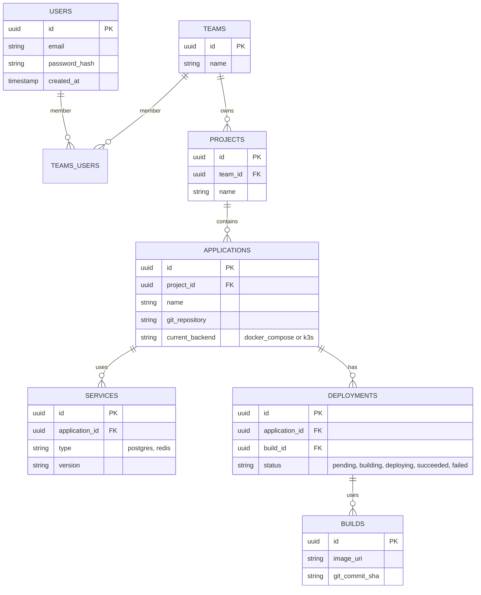

# Engineering Design Document: Helios PaaS

**Author:** Jules, Software Engineer
**Date:** October 3, 2025
**Version:** 2.0
**Status:** DRAFT

## 1. Overview & Goals

### 1.1. Introduction

This document provides a detailed engineering blueprint for "Helios," a next-generation, self-hosted Platform-as-a-Service (PaaS). The primary objective of Helios is to resolve the "PaaS Trilemma"—the inherent conflict between **Simplicity**, **Power**, and **Flexibility**—that characterizes the current PaaS market.

Existing solutions typically force a compromise. Tools like CapRover offer extreme simplicity at the cost of power and flexibility. Conversely, powerful management tools like Portainer, when layered on full-scale Kubernetes, provide immense power but sacrifice the radical simplicity desired by many developers. Helios aims to bridge this gap by creating a platform that offers a seamless, progressive journey from a simple, single-server deployment to a powerful, scalable, clustered environment, without requiring a disruptive architectural migration.

This document will outline the concrete technical architecture, technology stack, API specifications, database schema, and core implementation details required to build Helios.

### 1.2. High-Level Goals

*   **G1: Simplicity First:** The "zero-to-live-URL" experience for a new user deploying a standard application from a Git repository should take less than five minutes and require minimal a priori knowledge of containers or infrastructure.
*   **G2: Progressive Disclosure of Complexity:** The platform must not overwhelm users with advanced options. Simple use cases should be simple by default. Complexity (e.g., clustering, custom networking) should only be introduced when the user explicitly needs and requests it.
*   **G3: Seamless Scalability:** Provide a clear, low-friction, and ideally one-click upgrade path from a simple single-node deployment to a fault-tolerant, multi-node cluster capable of handling production workloads.
*   **G4: Flexibility and No Lock-In:** While providing a highly automated experience, Helios must always offer an "escape hatch." Users should be able to access the underlying infrastructure and configurations (e.g., `docker-compose.yml`, Kubernetes manifests, `kubeconfig` files) if needed. The platform should be deployable on any cloud provider or on-premises hardware.
*   **G5: Robust "Day 2" Operations:** Automate critical but often-neglected "Day 2" operational tasks, including SSL certificate management, database backups, and basic application monitoring.

---

## 2. High-Level Architecture & Component Overview

Helios is designed as a distributed system composed of several decoupled, microservice-style components that communicate via a central API and a message queue.

### 2.1. Architectural Diagram (Textual)

```
+-----------------------------------------------------------------------------------+
|                                 User (via Web UI / CLI)                           |
+-----------------------------------------------------------------------------------+
                 |                                      ^
                 | REST/GraphQL API Calls               | WebSocket Updates
                 v                                      |
+---------------------------------+-------------------------------------------------+
|   Control Plane (Go Backend)    |                                                 |
|                                 |                                                 |
| +-----------------------------+ | +---------------------------------------------+ |
| |        Core API Server      | | |         Day 2 Operations Engine             | |
| | (Manages Users, Projects)   | | | (Backups, SSL, Monitoring, Cluster Mgmt)    | |
| +-----------------------------+ | +---------------------------------------------+ |
|                                 |                                                 |
+-----------------v---------------+----------------^--------------------------------+
                  | Publishes Events               | Consumes Events
                  v                                ^
+---------------------------------+-------------------------------------------------+
|                         NATS Message Queue                                        |
|         ("deployment.requested", "build.succeeded", "cluster.provisioned")        |
+---------------------------------+-------------------------------------------------+
                  | Consumes Events                ^ Publishes Events
                  v                                ^
+---------------------------------+-------------------------------------------------+
| Build & Deployment Pipeline     |      Orchestration Abstraction Layer (OAL)      |
|                                 |                                                 |
| +-----------------------------+ | +---------------------------------------------+ |
| | Git Service (Clones Repo)   | | |   Heliosfile Parser & Validator             | |
| +-----------------------------+ | +---------------------------------------------+ |
| | Buildpack Engine (Paketo)   | | |   Compose Translator -> docker-compose.yml  | |
| +-----------------------------+ | +---------------------------------------------+ |
| | Dockerfile Engine           | | |   K8s Translator -> Kubernetes Manifests    | |
| +-----------------------------+ | +---------------------------------------------+ |
| | Image Registry (Pushes)     | | |   Execution Engine (SSH / Kube API)         | |
| +-----------------------------+ | +---------------------------------------------+ |
|                                 |                                                 |
+-----------------v---------------+----------------v--------------------------------+
                  |                                |
                  | Pushes Image                   | Deploys To
                  v                                v
+---------------------------------+-------------------------------------------------+
|   Internal Container Registry   |      User's Infrastructure (Target Servers)     |
|                                 |                                                 |
|                                 | +------------------+   +----------------------+ |
|                                 | | Single Server    |   | K3s Cluster          | |
|                                 | | (Docker Engine)  |   | (Multiple Nodes)     | |
|                                 | +------------------+   +----------------------+ |
|                                 |                                                 |
+---------------------------------+-------------------------------------------------+
```

### 2.2. Component Descriptions

*   **Frontend WebApp:** A modern, single-page application (SPA) that provides the primary user interface for managing Helios.
*   **Control Plane API:** A stateless Go backend that serves as the central brain. It handles all business logic, user authentication, and state management by interacting with the database. It does not perform long-running tasks itself; instead, it delegates them to other components by publishing events to the message queue.
*   **NATS Message Queue:** A lightweight, high-performance message bus used for asynchronous communication between the Control Plane and the operational components (Build Pipeline, OAL, Day 2 Engine). This decouples the components and makes the system resilient.
*   **Build & Deployment Pipeline:** A worker service that listens for `deployment.requested` events. It is responsible for cloning the user's Git repository, building a container image (using either Buildpacks or a Dockerfile), and pushing it to an internal registry.
*   **Orchestration Abstraction Layer (OAL):** The core of Helios's flexibility. This worker service listens for `build.succeeded` events. It parses a user-defined `Heliosfile`, translates it into the appropriate configuration for the target backend (Docker Compose or Kubernetes), and executes the deployment.
*   **Day 2 Operations Engine:** A worker service responsible for long-running and scheduled tasks, such as provisioning new servers for a K3s cluster, managing SSL certificates, performing database backups, and monitoring application health.
*   **PostgreSQL Database:** The single source of truth for all user, project, and application metadata. It does *not* store the live state of the running infrastructure, which is the responsibility of the orchestrator.

---

## 3. Technology Stack Selection & Justification

The technology stack is chosen to prioritize performance, reliability, developer productivity, and a strong open-source ecosystem.

| Component | Technology | Justification |
| :--- | :--- | :--- |
| **Frontend** | **SvelteKit + TypeScript** | **Pros:** High performance (compiles to vanilla JS), excellent developer experience, built-in reactivity, less boilerplate than React. **Cons:** Smaller component ecosystem than React. **Decision:** The performance benefits and streamlined development make it ideal for a responsive, modern UI. |
| **Backend API** | **Go (Golang)** | **Pros:** Exceptional performance, first-class concurrency (goroutines), static typing, simple deployment (single binary), ideal for building robust, high-performance APIs. **Cons:** Can be more verbose than Node.js for simple CRUD. **Decision:** Go's performance, reliability, and concurrency model are perfect for the core control plane. |
| **Database** | **PostgreSQL** | **Pros:** Unmatched reliability and data integrity, rich feature set (JSONB, transactions, robust indexing), large ecosystem, and proven scalability. **Cons:** Higher operational complexity than simpler databases. **Decision:** The gold standard for relational databases, providing the reliability needed for the core system. |
| **Message Queue** | **NATS** | **Pros:** Extremely lightweight, high-performance, simple API, cloud-native design with features like JetStream for persistence. **Cons:** Not as feature-rich as Kafka/RabbitMQ for complex routing. **Decision:** Its simplicity and performance are a perfect fit for the event-driven choreography between Helios components. |
| **Build Engine** | **Cloud Native Buildpacks (Paketo)** | **Pros:** Automates container image creation from source code without Dockerfiles, promotes security and reproducibility, and aligns with modern cloud-native practices. **Cons:** Less flexible than custom Dockerfiles for highly specific build logic. **Decision:** Provides the "zero-config" experience for G1, with Dockerfile support as the necessary escape hatch. |
| **Default Orchestrator** | **Docker Compose** | **Pros:** Ubiquitous, familiar to nearly all container developers, simple YAML format, perfect for single-node deployments. **Cons:** Not designed for multi-node clustering. **Decision:** The ideal choice for the "Simplicity First" goal. |
| **Cluster Orchestrator**| **K3s** | **Pros:** Fully compliant Kubernetes in a tiny binary, low resource usage, simple setup, access to the entire K8s ecosystem (Helm, etc.). **Cons:** Less battle-tested in massive-scale clusters than full K8s. **Decision:** The perfect "middle-ground" solution, providing a seamless path to Kubernetes power without its full complexity. |

---

## 4. Control Plane API Design (Abbreviated)

The API will be RESTful and adhere to standard conventions. All responses will be in JSON format.

### 4.1. Resource: `/projects`

*   **`POST /projects`**
    *   **Description:** Creates a new project.
    *   **Request Body:** `{"name": "My Awesome App"}`
    *   **Response (201):** `{"id": "proj_123", "name": "My Awesome App", "created_at": "..."}`
*   **`GET /projects/{projectId}`**
    *   **Description:** Retrieves a specific project.
    *   **Response (200):** `{"id": "proj_123", "name": "My Awesome App", "applications": [...]}`

### 4.2. Resource: `/projects/{projectId}/applications`

*   **`POST /projects/{projectId}/applications`**
    *   **Description:** Creates and initiates the first deployment of a new application from a Git repository.
    *   **Request Body:**
        ```json
        {
          "name": "webapp",
          "git_repository": "https://github.com/alice/my-awesome-app.git",
          "git_branch": "main"
        }
        ```
    *   **Response (202 Accepted):** Returns the initial application object and a `deployment` object with `status: "pending"`. The API immediately publishes a `deployment.requested` event to NATS.
        ```json
        {
          "id": "app_456",
          "name": "webapp",
          "deployments": [
            {"id": "dep_789", "status": "pending", ...}
          ]
        }
        ```

### 4.3. Resource: `/applications/{appId}/upgrade`

*   **`POST /applications/{appId}/upgrade`**
    *   **Description:** Initiates the upgrade process from a single-node (Docker Compose) deployment to a multi-node K3s cluster.
    *   **Request Body:**
        ```json
        {
          "provider": "digitalocean",
          "region": "nyc3",
          "node_count": 3,
          "node_size": "s-2vcpu-4gb",
          "credentials_id": "cred_abc"
        }
        ```
    *   **Response (202 Accepted):** Confirms the upgrade process has started. The API publishes a `cluster.provision.requested` event.

---

## 5. Database Schema Design

The schema will be implemented in PostgreSQL. The following is an abbreviated version of the core tables.

### 5.1. ERD (Mermaid Syntax)



### 5.2. `CREATE TABLE` Statements (Sample)

```sql
CREATE TABLE "users" (
  "id" uuid PRIMARY KEY DEFAULT gen_random_uuid(),
  "email" varchar NOT NULL UNIQUE,
  "password_hash" varchar NOT NULL,
  "created_at" timestamp NOT NULL DEFAULT (now())
);

CREATE TABLE "projects" (
  "id" uuid PRIMARY KEY DEFAULT gen_random_uuid(),
  "team_id" uuid NOT NULL,
  "name" varchar NOT NULL
);

CREATE TABLE "applications" (
  "id" uuid PRIMARY KEY DEFAULT gen_random_uuid(),
  "project_id" uuid NOT NULL,
  "name" varchar NOT NULL,
  "git_repository" varchar NOT NULL,
  "current_backend" varchar NOT NULL DEFAULT 'docker_compose',
  CONSTRAINT fk_project FOREIGN KEY(project_id) REFERENCES projects(id)
);

CREATE TABLE "deployments" (
  "id" uuid PRIMARY KEY DEFAULT gen_random_uuid(),
  "application_id" uuid NOT NULL,
  "status" varchar NOT NULL DEFAULT 'pending',
  "created_at" timestamp NOT NULL DEFAULT (now()),
  CONSTRAINT fk_application FOREIGN KEY(application_id) REFERENCES applications(id)
);
```

---

## 6. Orchestration Abstraction Layer (OAL) Implementation

The OAL is the technical core of Helios. Its primary job is to translate a developer-friendly manifest into a backend-specific configuration.

### 6.1. The `Heliosfile`

The developer defines their application stack in a simple `Heliosfile.yml` at the root of their repository.

```yaml
# Heliosfile.yml
name: my-awesome-app
version: 1

# Optional build instructions. If omitted, Buildpacks are used.
build:
  builder: "paketo-buildpacks/builder:base"
  # or:
  # dockerfile: ./Dockerfile.prod

services:
  # The main web application
  web:
    # Command to run on start
    command: "npm start"
    # Publicly expose this service on port 80/443
    http_port: 3000
    # Resource reservation
    cpu: 0.5 # cores
    memory: 512 # MB
    # Health check for zero-downtime deployments
    healthcheck:
      path: "/healthz"
      port: 3000
    # Environment variables
    env:
      NODE_ENV: production
      # References a managed service
      DATABASE_URL: ${postgres.URL}

  # A background worker
  worker:
    command: "npm run worker"
    # This service is not publicly exposed

# Managed backing services
databases:
  postgres:
    type: postgresql
    version: "15"
    # Allocate 10GB of persistent storage
    storage: 10 # GB
```

### 6.2. Translation Logic (Pseudocode)

```go
// OAL Worker Service
func handleBuildSucceededEvent(event BuildSucceededEvent) {
    app = db.GetApplication(event.AppID)
    heliosfile = git.GetHeliosfile(app.GitRepo, event.CommitSHA)

    switch app.CurrentBackend {
    case "docker_compose":
        composeConfig = translateToCompose(heliosfile)
        ssh.DeployComposeFile(app.TargetServer, composeConfig)
    case "k3s":
        kubeManifests = translateToK8s(heliosfile)
        k8s.ApplyManifests(app.Kubeconfig, kubeManifests)
    }
}

// Translator for Docker Compose
func translateToCompose(file Heliosfile) DockerCompose {
    compose := new(DockerCompose)
    for name, service := range file.services {
        svc := new(ComposeService)
        svc.Image = event.ImageURI // From the build event
        svc.Command = service.command
        // ... map env vars, ports, etc.
        compose.Services[name] = svc
    }
    // Add database services
    for name, db := range file.databases {
        dbSvc := new(ComposeService)
        dbSvc.Image = "postgres:" + db.version
        // ... map volumes, env vars for password, etc.
        compose.Services[name] = dbSvc
    }
    return compose
}

// Translator for Kubernetes
func translateToK8s(file Heliosfile) []K8sManifest {
    manifests := []K8sManifest{}
    for name, service := range file.services {
        // Create Deployment manifest
        deployment := new(K8sDeployment)
        deployment.Spec.Template.Spec.Containers[0].Image = event.ImageURI
        // ... map resource requests/limits, health probes
        manifests.append(deployment)

        // Create Service manifest
        service := new(K8sService)
        // ... map ports
        manifests.append(service)

        // Create Ingress if http_port is specified
        if service.http_port > 0 {
            ingress := new(K8sIngress)
            // ... configure ingress rules
            manifests.append(ingress)
        }
    }
    // Create StatefulSet, PVC, and Secret for databases
    for name, db := range file.databases {
        // ... logic to create these manifests
    }
    return manifests
}
```

---

## 7. Core Workflow Sequence Diagrams (Textual)

### 7.1. Workflow 1: First-Time Git Deployment

```
sequenceDiagram
    participant User
    participant Frontend
    participant API
    participant NATS
    participant BuildEngine
    participant OAL

    User->>Frontend: Clicks "Deploy from Git"
    Frontend->>API: POST /projects/{id}/applications (git_repo)
    API->>NATS: PUB "deployment.requested"
    Note right of API: Responds 202 Accepted to Frontend

    BuildEngine->>NATS: SUB "deployment.requested"
    BuildEngine->>Git: Clone repository
    BuildEngine->>Buildpacks: Create image
    BuildEngine->>Registry: Push image
    BuildEngine->>NATS: PUB "deployment.built" (image_uri)

    OAL->>NATS: SUB "deployment.built"
    OAL->>OAL: Parse Heliosfile
    OAL->>OAL: Translate to docker-compose.yml
    OAL->>UserServer (SSH): Copy file & run `docker-compose up`
    OAL->>NATS: PUB "deployment.succeeded"

    API->>NATS: SUB "deployment.succeeded"
    API->>DB: Update deployment status to "succeeded"
    API->>Frontend: (WebSocket) Send status update

    Frontend->>User: Show "Deployment Successful!"
```

### 7.2. Workflow 2: Upgrading to K3s Cluster

```sequenceDiagram
    participant User
    participant Frontend
    participant API
    participant NATS
    participant Day2Engine
    participant OAL

    User->>Frontend: Clicks "Upgrade to Cluster"
    Frontend->>API: POST /applications/{id}/upgrade
    API->>NATS: PUB "cluster.provision.requested"
    Note right of API: Responds 202 Accepted

    Day2Engine->>NATS: SUB "cluster.provision.requested"
    Day2Engine->>CloudProviderAPI: Create 3 VMs
    Day2Engine->>VMs (SSH): Install & configure K3s cluster
    Day2Engine->>DB: Store kubeconfig for cluster
    Day2Engine->>NATS: PUB "cluster.provision.succeeded"

    OAL->>NATS: SUB "cluster.provision.succeeded"
    Note right of OAL: This also triggers a new deployment
    OAL->>OAL: Translate Heliosfile to K8s manifests
    OAL->>K3s API: Apply manifests
    OAL->>K3s API: Poll deployment status until healthy
    OAL->>NATS: PUB "deployment.succeeded"

    Day2Engine->>NATS: SUB "deployment.succeeded" (for upgrade context)
    Day2Engine->>DNSProviderAPI: Update DNS A record to new Load Balancer IP
    Day2Engine->>NATS: PUB "upgrade.completed"

    API->>NATS: SUB "upgrade.completed"
    API->>DB: Update application backend to "k3s"
    API->>Frontend: (WebSocket) Send status update

    Frontend->>User: Show "Upgrade Complete!"
```

---

## 8. Conclusion

The architecture outlined in this document for the "Helios" PaaS directly addresses the PaaS Trilemma. It provides a concrete engineering path to create a platform that is simultaneously simple, powerful, and flexible. By leveraging a decoupled, event-driven architecture and a pluggable orchestration layer, Helios offers a "no-compromise" solution. It meets developers where they are with the simplicity of Docker Compose and provides a seamless, data-informed upgrade path to the power of the Kubernetes ecosystem via K3s. This approach not only solves a significant technical challenge but also aligns with the market's clear demand for a more progressive and less disruptive path to scalable application deployment.